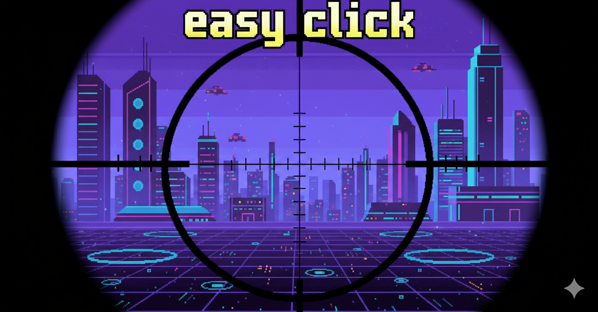

# Alvo Rápido - Easy Click!

Um jogo de arcade e precisão desenvolvido em Python com a biblioteca Pygame. O objetivo é testar os reflexos e a velocidade do jogador ao clicar em alvos que aparecem na tela, buscando a maior pontuação possível em um sistema de jogo com múltiplos níveis e combos.

Este projeto foi desenvolvido por Eugenio Domingues como trabalho para a disciplina de Linguagem de Programação Aplicada do centro universitário Uninter.

## Funcionalidades

O jogo foi desenvolvido com uma estrutura robusta e conta com diversas funcionalidades para criar uma experiência completa:

- **Modo "Quase Impossível":** Um novo desafio foi adicionado para testar suas habilidades ao extremo! Neste modo, você não pode errar nenhum clique. Qualquer erro ou clique fora do alvo resulta no fim do jogo, exigindo precisão total.
- **Três Níveis de Dificuldade Progressiva:** O jogo possui 3 níveis, cada um aumentando a velocidade de surgimento dos alvos e diminuindo seu tamanho.
- **Sistema de Pontuação Dinâmico:** A pontuação não é fixa! Quanto mais rápido o jogador clica em um alvo após ele aparecer, mais pontos base ele ganha.
- **Mecânica de Combo:** Acertos consecutivos aumentam um multiplicador de combo, que potencializa drasticamente a pontuação. Errar um clique ou acertar um alvo de penalidade quebra o combo.
- **Variedade de Alvos:**
  - **Alvo Normal (Vermelho):** Concede pontos base.
  - **Alvo Bônus (Verde):** Multiplica os pontos base do acerto.
  - **Alvo de Penalidade (Azul):** Zera o combo e subtrai pontos.
- **Bônus por Tempo:** Ao concluir o último nível, os segundos restantes são convertidos em um bônus de pontos, recompensando a agilidade.
- **Ranking de High Scores:** O jogo salva um Top 5 dos melhores recordes em um arquivo `highscores.json`, registrando o nome (6 caracteres) e a pontuação dos jogadores.
- **Menu Navegável Completo:** Um menu inicial completo com opções para:
  - Iniciar o Jogo
  - Ver as Regras
  - Tela Sobre
  - Visualizar o Ranking de Recordes (com opção de reset)
  - Sair do Jogo
- **Efeitos Sonoros e Música:** O jogo conta com música de fundo em loop e efeitos sonoros para navegação no menu, acertos, erros e transições de estado, tornando a experiência mais imersiva.

---

## Tecnologias Utilizadas

- **Python 3**
- **Pygame** (biblioteca para desenvolvimento de jogos)

---

## Assets / conteúdo

- Imagens geradas com AI (Gemini)
- Música gerada com AI (Suno)
- Assets utilizados disponibizados pela comunidade no itch.io
